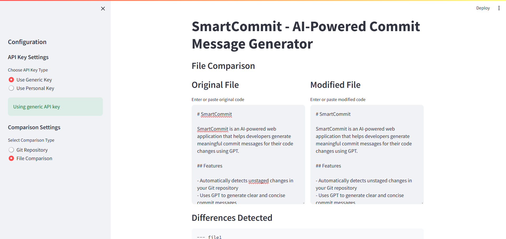
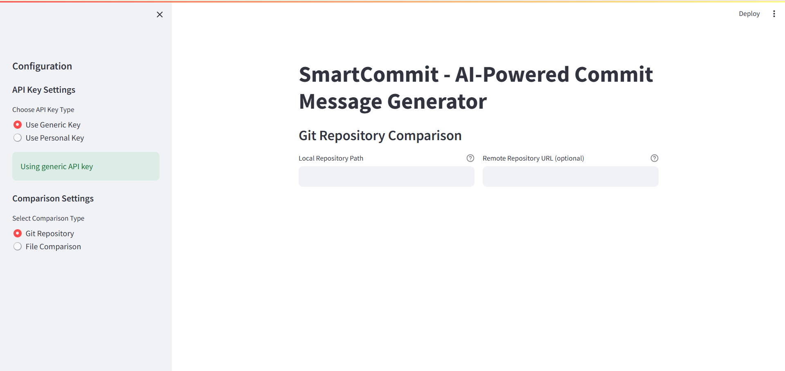
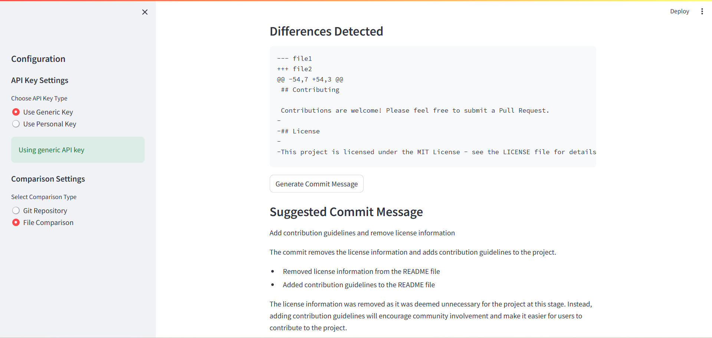

# SmartCommit

SmartCommit is an AI-powered web application that helps developers generate meaningful commit messages for their code changes using GPT.

## Screenshots

### File Comparison View

*Compare different versions of files and generate commit messages based on the changes.*

### Git Repository View

*Connect to local and remote Git repositories to analyze changes.*

### Commit Message Generation

*Get AI-generated commit messages that accurately describe your changes.*

## Features

- Automatically detects unstaged changes in your Git repository
- Uses GPT to generate clear and concise commit messages
- Provides a user-friendly interface through Streamlit
- Allows direct committing of changes with the generated message
- Supports both file comparison and Git repository modes
- Compare local and remote repositories
- Generate detailed commit messages with explanations

## Prerequisites

- Python 3.8 or higher
- Git
- OpenAI API key

## Installation

1. Clone the repository:
```bash
git clone https://github.com/yourusername/SmartCommit.git
cd SmartCommit
```

2. Install the required dependencies:
```bash
pip install -r requirements.txt
```

3. Create a `.env` file in the project root and add your OpenAI API key:
```
OPENAI_API_KEY=your_api_key_here
```

## Usage

1. Run the Streamlit application:
```bash
streamlit run app.py
```

2. Open your web browser and navigate to the URL shown in the terminal (usually http://localhost:8501)

3. Choose your comparison mode:
   - **File Comparison**: Compare two versions of a file directly
   - **Git Repository**: Connect to a Git repository to analyze changes

4. For Git Repository mode:
   - Enter the path to your local Git repository
   - Optionally provide a remote repository URL for comparison

5. For File Comparison mode:
   - Paste or enter the original and modified code
   - Click "Generate Commit Message" to get an AI-generated description

6. Review the generated commit message and use it in your workflow

## Contributing

Contributions are welcome! Please feel free to submit a Pull Request.

## License

This project is licensed under the MIT License - see the LICENSE file for details.